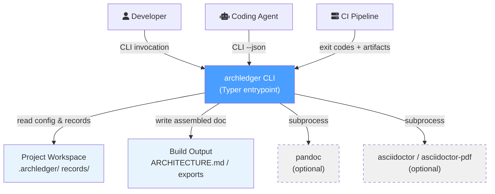

archledger operates as a local CLI tool. External actors interact through shell invocations. Optional converter tools (pandoc, asciidoctor) are invoked as subprocesses for non-native export formats.

