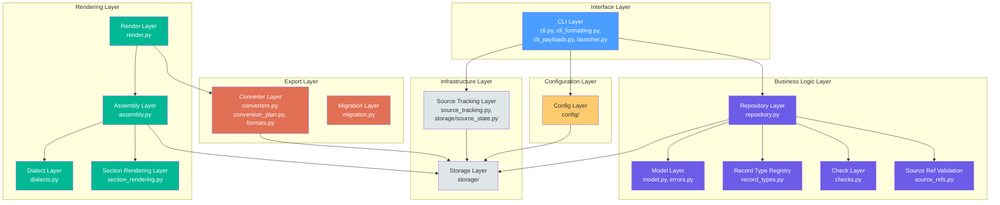

The system is organized as a layered pipeline. User input flows down from the CLI through business logic to storage. Rendering flows upward from storage through assembly to the build output.

```mermaid
graph TB
    subgraph "Interface Layer"
        CLI["CLI Layer\ncli.py, cli_formatting.py,\ncli_payloads.py, launcher.py"]
    end

    subgraph "Business Logic Layer"
        Repo["Repository Layer\nrepository.py"]
        Model["Model Layer\nmodel.py, errors.py"]
        Registry["Record Type Registry\nrecord_types.py"]
        Checks["Check Layer\nchecks.py"]
        SrcRefs["Source Ref Validation\nsource_refs.py"]
    end

    subgraph "Configuration Layer"
        Config["Config Layer\nconfig/"]
    end

    subgraph "Rendering Layer"
        Render["Render Layer\nrender.py"]
        Assembly["Assembly Layer\nassembly.py"]
        Dialect["Dialect Layer\ndialects.py"]
        SectionR["Section Rendering Layer\nsection_rendering.py"]
    end

    subgraph "Export Layer"
        Converter["Converter Layer\nconverters.py,\nconversion_plan.py, formats.py"]
        Migration["Migration Layer\nmigration.py"]
    end

    subgraph "Infrastructure Layer"
        Storage["Storage Layer\nstorage/"]
        Tracking["Source Tracking Layer\nsource_tracking.py,\nstorage/source_state.py"]
    end

    CLI --> Repo
    CLI --> Config
    Repo --> Model
    Repo --> Registry
    Repo --> Checks
    Repo --> SrcRefs
    Repo --> Storage

    Render --> Assembly
    Assembly --> Dialect
    Assembly --> SectionR
    Assembly --> Storage

    Render --> Converter
    Converter --> Storage

    CLI --> Tracking
    Tracking --> Storage

    Config --> Storage

    style CLI fill:#4a9eff,color:#fff
    style Repo fill:#6c5ce7,color:#fff
    style Model fill:#6c5ce7,color:#fff
    style Registry fill:#6c5ce7,color:#fff
    style Checks fill:#6c5ce7,color:#fff
    style SrcRefs fill:#6c5ce7,color:#fff
    style Config fill:#fdcb6e
    style Render fill:#00b894,color:#fff
    style Assembly fill:#00b894,color:#fff
    style Dialect fill:#00b894,color:#fff
    style SectionR fill:#00b894,color:#fff
    style Converter fill:#e17055,color:#fff
    style Migration fill:#e17055,color:#fff
    style Storage fill:#dfe6e9
    style Tracking fill:#dfe6e9
```
