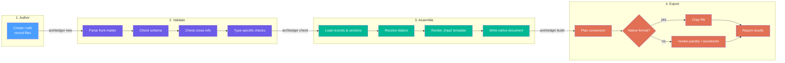

The build pipeline processes architecture records through four stages. Native Markdown and AsciiDoc builds require no external tools. Non-native exports delegate to pandoc or asciidoctor.

```mermaid
flowchart LR
    subgraph "1. Author"
        A1["Create / edit\nrecord files"]
    end

    subgraph "2. Validate"
        V1["Parse front matter"]
        V2["Check schema"]
        V3["Check cross-refs"]
        V4["Type-specific checks"]
        V1 --> V2 --> V3 --> V4
    end

    subgraph "3. Assemble"
        R1["Load records & sections"]
        R2["Resolve dialect"]
        R3["Render Jinja2 template"]
        R4["Write native document"]
        R1 --> R2 --> R3 --> R4
    end

    subgraph "4. Export"
        E1["Plan conversion"]
        E2{"Native format?"}
        E3["Copy file"]
        E4["Invoke pandoc / asciidoctor"]
        E5["Report results"]
        E1 --> E2
        E2 -->|yes| E3 --> E5
        E2 -->|no| E4 --> E5
    end

    A1 -->|"archledger new"| V1
    V4 -->|"archledger check"| R1
    R4 -->|"archledger build"| E1

    style A1 fill:#4a9eff,color:#fff
    style V1 fill:#6c5ce7,color:#fff
    style V2 fill:#6c5ce7,color:#fff
    style V3 fill:#6c5ce7,color:#fff
    style V4 fill:#6c5ce7,color:#fff
    style R1 fill:#00b894,color:#fff
    style R2 fill:#00b894,color:#fff
    style R3 fill:#00b894,color:#fff
    style R4 fill:#00b894,color:#fff
    style E1 fill:#e17055,color:#fff
    style E2 fill:#e17055,color:#fff
    style E3 fill:#e17055,color:#fff
    style E4 fill:#e17055,color:#fff
    style E5 fill:#e17055,color:#fff
```
